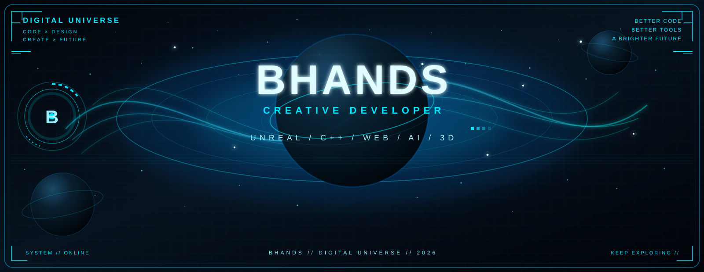

<div align="center">



<br>

### `BHANDS // DIGITAL UNIVERSE`

**CREATIVE DEVELOPER · DIGITAL CREATOR · TECHNOLOGY EXPLORER**

</div>

---

<div align="center">


</div>

---

## `// SYSTEM STATUS`

```text
┌──────────────────────────────────────────────────────────────┐
│                     BHANDS SYSTEM                            │
├──────────────────────────────────────────────────────────────┤
│                                                              │
│  STATUS        ONLINE                                        │
│  MODE          CREATIVE / ENGINEERING                        │
│  DOMAIN        GAME · WEB · AI · 3D · MEDIA                 │
│  ENGINE        UNREAL ENGINE / UNITY                         │
│  LANGUAGE      C++ / C# / JAVASCRIPT                        │
│  INTERFACE     DIGITAL HUD / INTERACTIVE UI                  │
│                                                              │
└──────────────────────────────────────────────────────────────┘
```

---

## `// ABOUT`

Hi, I'm **BHANDS**.

A developer focused on the intersection of **real-time graphics, interactive applications, AI, computer vision and digital experiences**.

I enjoy turning technical ideas into visual and interactive systems.

My current interests include:

* 🎮 Unreal Engine
* 🧩 Unity
* 🌐 Web / WebGL
* 🤖 AI & Computer Vision
* 🕺 Body Tracking
* 👁️ Face Tracking
* 📷 Media Processing
* 🧠 OCR
* 🥽 AR / XR
* 🎨 Creative Coding
* 🌌 Generative Visual Effects
* 🎵 Interactive Music Experiences

---

## `// TECHNOLOGY MATRIX`

### `REAL-TIME ENGINE`

```text
UNREAL ENGINE
████████████████████████████████████████

UNITY
██████████████████████████████████████

REAL-TIME RENDERING
████████████████████████████████████
```

### `PROGRAMMING`

```text
C++
████████████████████████████████████████

C#
██████████████████████████████████████

JAVASCRIPT
████████████████████████████████████

WEBGL
██████████████████████████████████
```

### `AI / COMPUTER VISION`

```text
AI
████████████████████████████████████

OCR
██████████████████████████████████

POSE TRACKING
████████████████████████████████

FACE TRACKING
██████████████████████████████

MEDIA PROCESSING
████████████████████████████
```

---

## `// WHAT I BUILD`

### 🎮 Interactive Applications

Building real-time interactive applications with:

* Unreal Engine
* Unity
* C++
* C#
* Blueprint
* Real-time rendering
* Interactive UI

---

### 🤖 AI & Computer Vision

Exploring applications of AI and computer vision in interactive systems.

Examples include:

* OCR
* Face Landmark Detection
* Body Tracking
* Gesture Recognition
* Pose Estimation
* Object Recognition
* Camera-based interaction
* Real-time media analysis

---

### 🕺 Digital Human / Virtual Try-On

Experimenting with:

```text
CAMERA
   ↓
BODY TRACKING
   ↓
SKELETON
   ↓
POSE ANALYSIS
   ↓
VIRTUAL MODEL
   ↓
REAL-TIME INTERACTION
```

Combining body tracking, 3D models and real-time rendering to create interactive virtual experiences.

---

### 🌐 Web & WebGL

Building browser-based interactive experiences with:

* JavaScript
* WebGL
* Unity WebGL
* WebAR
* Mobile browser interaction
* Camera / Media APIs
* Interactive visual effects

---

### 🎵 Creative Web Experiences

I also enjoy experimenting with music and visual experiences.

Combining:

```text
MUSIC
  +
PARTICLES
  +
NEBULA
  +
HUD
  +
INTERACTION
```

to create immersive digital interfaces.

---

# `// BHANDS DIGITAL UNIVERSE`

The visual identity of this profile is based on a fictional digital universe.

```text
                     BHANDS
                       │
             ┌─────────┴─────────┐
             │                   │
           CREATE              EXPLORE
             │                   │
       ┌─────┼─────┐       ┌─────┼─────┐
       │     │     │       │     │     │
      GAME   AI    WEB     3D   MEDIA  AR/XR
       │     │     │       │     │     │
       └─────┴─────┴───────┴─────┴─────┘
                       │
                  DIGITAL UNIVERSE
```

---

# `// VISUAL SYSTEM`

The GitHub profile uses a custom **pure SVG HUD visual system**.

### Hero specification

```text
Canvas
1600 × 620

Background
Black / Deep Space

Primary Visual
Cyan / Blue Neon Nebula

Elements
• Particle field
• Orbital system
• Planet
• Energy lines
• HUD panels
• Grid
• Scanlines
• Neon borders
• Digital interface elements
```

The Hero is implemented as a **pure SVG**, rather than embedding a PNG inside an SVG container.

Therefore it can be:

* rendered directly by browsers
* stored directly in the repository
* displayed inside GitHub README
* version controlled with Git
* edited as vector graphics
* scaled without rasterization artifacts

---

# `// PROJECT STRUCTURE`

Recommended repository structure:

```text
your-repo/
│
├── README.md
│
└── assets/
    │
    └── bhands-hud-hero.svg
```

The Hero SVG should be placed at:

```text
assets/bhands-hud-hero.svg
```

Then referenced from the README:

```html
<div align="center">


</div>
```

---

# `// SVG DESIGN`

The Hero uses a layered SVG composition.

```text
BACKGROUND
    │
    ├── Deep Space
    │
    ├── Nebula
    │
    ├── Particle Field
    │
    └── Grid
         │
         ▼
ORBITAL SYSTEM
    │
    ├── Planet
    ├── Orbit Rings
    ├── Energy Lines
    └── Particle Trails
         │
         ▼
HUD INTERFACE
    │
    ├── Left Panel
    ├── Right Panel
    ├── Top Information
    ├── Bottom Information
    └── Digital Indicators
         │
         ▼
TYPOGRAPHY
    │
    ├── BHANDS
    ├── CREATIVE DEVELOPER
    ├── UNREAL
    ├── C++
    ├── WEB
    ├── AI
    └── 3D
```

---

# `// CORE STACK`

<div align="center">

| Category    | Technologies                     |
| ----------- | -------------------------------- |
| Game Engine | Unreal Engine                    |
| Game Engine | Unity                            |
| Programming | C++                              |
| Programming | C#                               |
| Web         | JavaScript                       |
| Web         | WebGL                            |
| AI          | Computer Vision                  |
| AI          | OCR                              |
| Tracking    | Body Tracking                    |
| Tracking    | Face Tracking                    |
| Graphics    | 3D / Real-Time Rendering         |
| Media       | Video / Audio / Image Processing |
| AR/XR       | WebAR / XR                       |

</div>

---

# `// CURRENT EXPLORATION`

```text
[01] REAL-TIME GRAPHICS
       │
       ├── Unreal Engine
       ├── Unity
       └── Shader / Material

[02] COMPUTER VISION
       │
       ├── OCR
       ├── Face Tracking
       ├── Body Tracking
       └── Gesture Recognition

[03] WEB
       │
       ├── WebGL
       ├── WebAR
       ├── Browser Camera
       └── Interactive UI

[04] CREATIVE TECHNOLOGY
       │
       ├── Generative Visuals
       ├── Particle Systems
       ├── Music Visualization
       └── Digital HUD

[05] AI
       │
       ├── AI Assisted Development
       ├── Computer Vision
       └── Intelligent Interaction
```

---

# `// PHILOSOPHY`

> **Technology should not only solve problems.
> It should also create experiences.**

I like projects that sit somewhere between:

```text
ENGINEERING
     +
DESIGN
     +
VISUALS
     +
INTERACTION
```

The goal is not simply to make something work.

The goal is to make it:

```text
FUNCTIONAL
     ↓
INTERACTIVE
     ↓
VISUAL
     ↓
MEMORABLE
```

---

# `// WORKFLOW`

My typical development workflow:

```text
IDEA
 │
 ▼
PROTOTYPE
 │
 ▼
TECHNICAL VALIDATION
 │
 ▼
REAL-TIME IMPLEMENTATION
 │
 ▼
VISUAL POLISH
 │
 ▼
OPTIMIZATION
 │
 ▼
DEPLOYMENT
```

---

# `// CREATIVE LOOP`

```text
        ┌───────────────┐
        │     IDEA      │
        └───────┬───────┘
                │
                ▼
        ┌───────────────┐
        │   EXPERIMENT  │
        └───────┬───────┘
                │
                ▼
        ┌───────────────┐
        │   PROTOTYPE   │
        └───────┬───────┘
                │
                ▼
        ┌───────────────┐
        │   BUILD       │
        └───────┬───────┘
                │
                ▼
        ┌───────────────┐
        │   POLISH      │
        └───────┬───────┘
                │
                └───────────────┐
                                │
                                ▼
                             REPEAT
```

---

# `// FEATURED AREAS`

<div align="center">

### 🎮 GAME DEVELOPMENT

Real-time interactive experiences using Unreal Engine and Unity.

### 🤖 AI / CV

OCR, body tracking, face tracking and intelligent interaction.

### 🌐 WEB

WebGL, WebAR and browser-based interactive applications.

### 🎨 CREATIVE CODING

Particles, shaders, generative graphics and digital interfaces.

### 🌌 DIGITAL EXPERIENCES

Combining technology, design, sound and interaction.

</div>

---

# `// GITHUB`

<div align="center">

[](https://github.com/Bhands6)

</div>

---

# `// CONNECT`

<div align="center">

```text
╔══════════════════════════════════════════════════════╗
║                                                      ║
║                  BHANDS ONLINE                       ║
║                                                      ║
║       BUILD  ·  CREATE  ·  EXPLORE  ·  REPEAT       ║
║                                                      ║
╚══════════════════════════════════════════════════════╝
```

</div>

---

<div align="center">

### `BHANDS // DIGITAL UNIVERSE`

**BUILD THE FUTURE · ONE SYSTEM AT A TIME**

<br>

`[ SYSTEM ONLINE ]`

</div>
